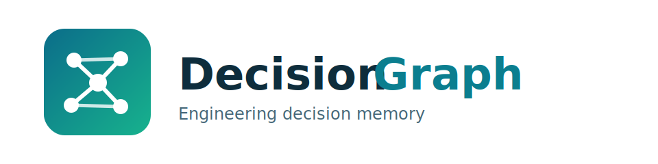
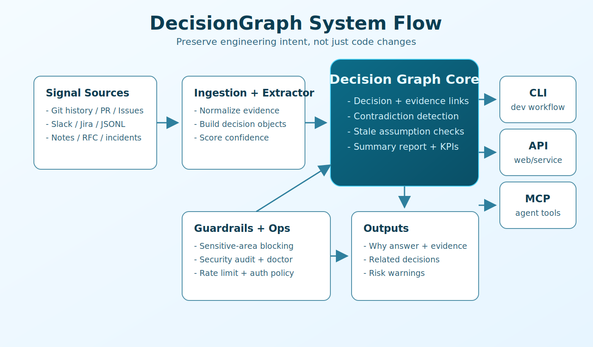

# DecisionGraph

Engineering Decision Memory System with `CLI + API + MCP`, plus a docs frontend in [`docs`](./docs).

<p align="center">
  
</p>

## Why DecisionGraph
Software teams usually remember **what changed**, but lose **why it changed**.
DecisionGraph keeps that reasoning traceable with evidence so teams can move fast without repeating old mistakes.

- Preserve architectural decisions with supporting evidence.
- Answer `why / who / when / what-changed` queries quickly.
- Add pre-change guardrails before risky refactors.
- Expose the same decision memory through CLI, HTTP API, and MCP tools.

## Visual Architecture


## Core Capabilities

### 1) Ingestion
- Local text/files/directories.
- Git commit history.
- GitHub PRs and Issues.
- Slack export JSON.
- Jira export JSON.
- Generic JSONL event streams.

### 2) Decision Intelligence
- Decision query with confidence + warnings.
- Contradiction detection.
- Stale assumption detection from live metrics.
- Summary report and graph snapshot.

### 3) Ops + Strategy Utilities
- KPI snapshots and scenario checks.
- Evaluation against JSONL benchmark datasets.
- Security audit, doctor checks, release checks.
- Strategy section library/search for GTM and product framing.

## Quickstart (Backend)
```bash
python -m pip install -e ".[dev]"
decisiongraph init --reset
decisiongraph seed-demo
decisiongraph serve --host 127.0.0.1 --port 8000
```

Quickstart demo:


Health check:
```bash
curl http://127.0.0.1:8000/health
```

Open API docs:
- `http://127.0.0.1:8000/docs`

## Quickstart (Docker)
```bash
cp .env.example .env
docker compose up --build -d
```

Check health:
```bash
curl http://127.0.0.1:8000/health
```

Tail logs / stop:
```bash
docker compose logs -f decisiongraph
docker compose down
```

Production note:
- If `DECISIONGRAPH_ENV=production`, set `DECISIONGRAPH_API_TOKEN` in `.env` (or set `DECISIONGRAPH_REQUIRE_TOKEN_IN_PRODUCTION=false` intentionally).

## CLI-Only Mode (No Web Server)
If you only want terminal usage, skip `decisiongraph serve`.

```bash
python -m pip install -e ".[dev]"
decisiongraph init --reset
decisiongraph seed-demo
decisiongraph chat
```

Inside chat, ask questions directly or use commands:

```text
/help
/list 20
/get <decision_id>
/guard <change request>
/contradictions
/stale
/metrics
/graph
/report json
/exit
```

Non-interactive CLI equivalents:

```bash
decisiongraph list
decisiongraph query "Why did we cap payment retries at 2?"
decisiongraph guardrail "Increase retry attempts in payment flow"
```

If `decisiongraph` command is not available in PATH:

```bash
python -m decisiongraph list
python -m decisiongraph query "Why did we cap payment retries at 2?"
```

## Quickstart (Docs Frontend)
```bash
cd docs
npm install
npm run dev
```

## MCP Server (stdio)
```bash
decisiongraph mcp
```

## Environment Setup
Create env file:

```bash
cp .env.example .env
```

Windows PowerShell:

```powershell
Copy-Item .env.example .env
```

Key variables:
- `DECISIONGRAPH_ENV=development`
- `DECISIONGRAPH_DATA_PATH=data/decisiongraph.json`
- `DECISIONGRAPH_API_TOKEN` optional API key (`x-api-key` header)
- `DECISIONGRAPH_REQUIRE_TOKEN_IN_PRODUCTION=true` blocks startup in production without token
- `DECISIONGRAPH_RATE_LIMIT_PER_MINUTE=240` per-client rate limit (`0` disables)
- `DECISIONGRAPH_CORS_ORIGINS=http://localhost:3000,http://127.0.0.1:5173`
- `DECISIONGRAPH_GITHUB_TOKEN` for GitHub ingestion
- `DECISIONGRAPH_GITHUB_BASE_URL=https://api.github.com`
- `SE_URL` legacy fallback (prefer `DECISIONGRAPH_GITHUB_BASE_URL`)
- `GROQ_API_KEY`, `GROQ_MODELS` optional model integration

Security note:
- Never commit real secrets in `.env`.
- Commit only `.env.example`.

## End-to-End Demo (2 Minutes)

1. Seed data and run API:
```bash
decisiongraph init --reset
decisiongraph seed-demo
decisiongraph serve --host 127.0.0.1 --port 8000
```

2. Ask a why-question:
```bash
curl -X POST http://127.0.0.1:8000/api/query \
  -H "content-type: application/json" \
  -d '{"question":"Why did we cap payment retries at 2?"}'
```

3. Run guardrail before change:
```bash
curl -X POST http://127.0.0.1:8000/api/guardrail \
  -H "content-type: application/json" \
  -d '{"change_request":"Increase retry attempts in payment flow"}'
```

4. Check stale assumptions:
```bash
curl http://127.0.0.1:8000/api/assumptions/stale
```

## API Surface (Main Endpoints)

### System
- `GET /health`
- `GET /api/report/summary?format=json|markdown`

### Decisions
- `GET /api/decisions`
- `GET /api/decisions/{decision_id}`
- `POST /api/query`
- `POST /api/guardrail`
- `GET /api/contradictions`
- `GET /api/assumptions/stale`
- `GET /api/metrics`
- `POST /api/metrics`
- `GET /api/graph`

### Ingestion
- `POST /api/ingest`
- `POST /api/ingest/directory`
- `POST /api/ingest/git`
- `POST /api/ingest/jsonl`
- `POST /api/ingest/github`
- `POST /api/ingest/slack-export`
- `POST /api/ingest/jira-json`

### Intelligence / Ops
- `GET /api/scenarios/run`
- `GET /api/kpi/snapshot`
- `POST /api/eval/dataset`
- `POST /api/research/scorecard`
- `GET /api/research/interview-script`
- `POST /api/research/design-partner-progress`
- `GET /api/strategy/sections`
- `GET /api/strategy/section/{section_id}`
- `GET /api/strategy/search?q=...`
- `GET /api/ops/doctor`
- `GET /api/ops/runbook`
- `GET /api/ops/release-check`
- `GET /api/ops/security-audit`
- `GET /api/schema/info`

## CLI Reference

### Core
- `decisiongraph init [--reset]`
- `decisiongraph seed-demo`
- `decisiongraph chat [--list-limit 20] [--guardrail-limit 3]`
- `decisiongraph list --limit 20`
- `decisiongraph get <decision_id>`
- `decisiongraph query "..."`
- `decisiongraph guardrail "..."`
- `decisiongraph contradictions`
- `decisiongraph stale-assumptions`
- `decisiongraph metric-set --key ... --value ... [--unit ...]`
- `decisiongraph metrics`
- `decisiongraph graph`
- `decisiongraph report --format markdown|json [--output ...]`

### Ingestion
- `decisiongraph ingest --source <file> --source-id <id> [--source-type note]`
- `decisiongraph ingest-text --source-id <id> --text "..." [--source-type note]`
- `decisiongraph ingest-dir --directory <dir> [--pattern "*.md"]`
- `decisiongraph ingest-git --repo <repo_path> [--max-commits 200] [--ref HEAD]`
- `decisiongraph ingest-jsonl --source <file.jsonl> [--source-type external]`
- `decisiongraph ingest-github --owner <org> --repo <name> [--state all]`
- `decisiongraph ingest-slack-export --export-dir <dir> [--max-messages 1000]`
- `decisiongraph ingest-jira-json --source <jira.json>`

### Insights + Ops
- `decisiongraph scenarios`
- `decisiongraph kpi`
- `decisiongraph eval-dataset --dataset <eval.jsonl>`
- `decisiongraph research-score --pain-frequency ... --impact ...`
- `decisiongraph research-script`
- `decisiongraph design-partner-progress`
- `decisiongraph strategy-list | strategy-show <section> | strategy-search "..."`
- `decisiongraph doctor | runbook | release-check | security-audit | schema-info`

## MCP Tooling
Run stdio server:
```bash
decisiongraph mcp
```

Tool groups:
- Core tools: query, list, guardrail, contradictions, stale assumptions, metrics, graph, report.
- Ingestion tools: git/jsonl/github/slack/jira connectors.
- Insight tools: scenarios, KPI snapshot, dataset evaluation, research scoring.
- Strategy/Ops tools: strategy sections, doctor, runbook, release check, security audit.

## Project Structure
```text
src/decisiongraph/
  api.py                 FastAPI app assembly
  service.py             Core orchestration logic
  store.py               JSON store with locking + atomic writes
  integrations.py        Connectors (git, GitHub, Slack, Jira, JSONL)
  mcp_server.py          MCP server bootstrap
  cli.py                 Typer CLI entrypoint
  api_routes/            API routers
  cli_commands/          CLI command groups
  mcp_toolsets/          MCP tool groups

tests/                   Backend test suite
docs/                    Frontend docs app (Vite + React)
assets/                  README visual assets
```

## Quality and Validation
Local quality commands:
```bash
python -m pytest -q
cd docs && npm run lint && npm run build
```

Latest local validation (2026-04-25):
- Backend tests: pass
- Frontend lint: pass
- Frontend build: pass

CI pipeline:
- [`.github/workflows/ci.yml`](./.github/workflows/ci.yml)

## Delivery Scope (3 Rounds)
1. Round 1 (Core): ingestion, extraction, query, guardrail, contradiction, stale assumptions.
2. Round 2 (Surface): connectors + CLI/API/MCP interfaces.
3. Round 3 (Outer Ring): insights, strategy, ops, docs, operational checks.

## Notes for Contributors
- Keep backward compatibility for API and CLI contracts.
- Add tests for any behavior change.
- Prefer evidence-linked decision entries over free-form notes.

## Tiếng Việt (Tóm tắt nhanh)
DecisionGraph là hệ thống lưu trí nhớ quyết định kỹ thuật để trả lời nhanh câu hỏi "vì sao code đang như vậy".
Bạn có thể ingest từ Git/GitHub/Slack/Jira/JSONL, query theo ngữ nghĩa, chạy guardrail trước refactor, và expose cùng logic qua CLI + API + MCP.
